--- 
title: "Making of Individual Project"
author: "Vidyashree Venkatesh"
date: "`r Sys.Date()`"
site: bookdown::bookdown_site
documentclass: book
bibliography: [book.bib, packages.bib]
biblio-style: apalike
link-citations: yes
description: "This is report on making of the Individual Project as part of the course MSIS 2629: Dashboards, Scorecards, and Visualization "
---

# Project Objective:
To explore the data set associated with the city of Chicago’s Automated Speed Enforcement Program and to transform the data into interesting visualizations by exploring and analyzing the data. And to draw three interesting insights from the data to be presentable to the mayor of Chicago in the form visualization. Stages of project development.

Stage 1: Data Exploration

Stage 2: Extracting interesting aspects from the data

Stage 3: Improvising the stage 2 output with advanced features of Tableau.

# Summary The Data:
The Data set provides an accurate view into the Automated Speed Enforcement Program violations taking place in Children's Safety Zones.
Each row in the data set represents speed light camera violation

Data Source: [@data]

# Overview of the Automated Speed Enforcement Program:
It is a program undertaken by the city of Chicago to protect children and other pedestrians by speeding motor vehicles. The program uses enhanced safety measures such as Pedestrian refuge islands, Safety zone signage, and street stencils, High-visibility crosswalk markings, Speed feedback signs and many more. The automated speed enforcement cameras are one among the program’s safety measure, these automated safety cameras to identify and ticket motorists who are breaking the law by exceeding the speed limits. The registered owner of the speeding vehicle will be issued the speeding ticket.
[@program]

# Stage 1: Observations from Data Exploration
As part of the data exploration developed distinct visualizations in Tableau some of the key observations were that there existed a total of 5,159,847 violations captured through the speed cameras between 2014 to present (at the time of data collection). Although the violations are declining crosswise over time, the violations across month are fluctuating. The violations captured across the cameras in different locations and positions vary significantly, and certain areas have higher violations recorded consistently. 

Learnings gained after this stage of the project by self-critiquing the visualizations.

•    With the intended audience in mind, visualizations must be self-exploratory and straightforward and must involve less effort.

•    Use of additional colors to be avoided.

•    Use of complex visualizations to convey a simple message to be avoided. 

•    Beautification of the visualization with the attractive features of the tableau to be resisted.

Source: [@dataexp]

# Stage 2:Development of insights from the data

The goal of this stage of the project is to draw appealing aspects from data to present the mayor of Chicago and also to incorporate the lessons learned in the data exploration stage.
Firstly, it is essential to understand what sort of insight will the mayor be interested in or what ideas from the data be helpful for the mayor to take further actions on the automated speed enforcement program. Also, most importantly it is to be understood that the objective of such a program is not to capture more and more violations instead to enforce speed limit with various measures and bring in public awareness and reduce the mishaps from over speed. With this in consideration, the following questions pervade to explore data and are the focus of the analysis made.

•    What impact has the speed enforcement program made on the violation activity over time since enforced? Does the event involve a trend or pattern?

•    How efficient are the camera locations in capturing the violations? Is it something good or bad to learn that specific camera in particular areas consistently capture significant number of violations?

•    In terms of violation breaches collectively at zip code level are there a sufficient number of cameras placed or are they more than necessary?

## Finding 1:
The basis of this finding is to understand how the traffic safety with respect to speed violations has changed after the camera installation and how is the trend followed across months. 

**Associated Visualizations:**
Below visualization was the initial version of violations across years.

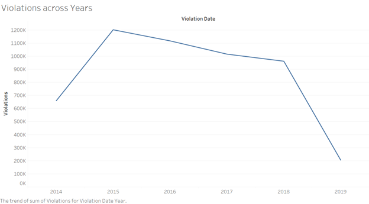

With the above visualization the trend line follows a steep decline from year 2018 to 2019, that’s because the dataset does not consist of data for entire year of 2019. This trend would present a deceptive notion of drastic decline of violations. 

The visualization was improved with the help of filters in tableau where years from 2014 to 2018 were selected and the forecast feature was incorporated to estimate the trend proceeding 2018. 

Below is the improvised version of the violation trend. Line graph are more suitable to represent the trend lines hence the below graph is depicted in the line chart form.

Source:[@tableau]
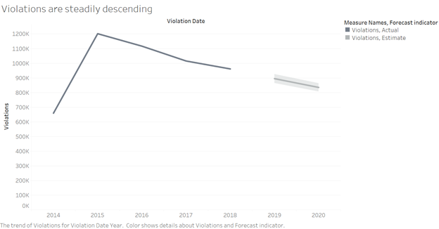

Further the analysis how the violations varied across months was observed from below visualization. A timeline chart is incorporated here to stretch the time axis and will let us zoom in and out to access more details from the overall trend.

Source:[@tableau]
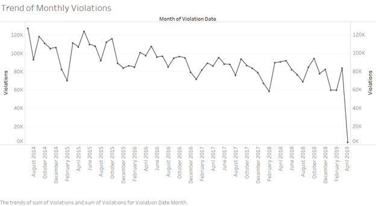

The decline in the trend is further investigated to learn that there exists an average of 20% drop in violations from 2015 to 2018 across month. In deducing this visualization data for the year 2014 and 2019 are not chosen as there is no data availability for a year long. The line graphs are chosen as they best depict the trends. And the difference in % is shown through a down ward column chart to show negative percentage. 

Source:[@tableau]
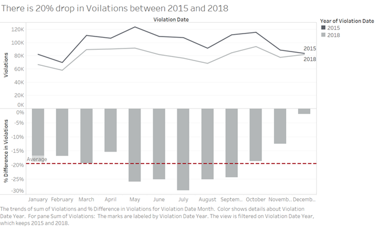

**Result:** 

It can be inferred that there is ~20% reduction in violations at safety zones after camera installation and the trend would continue to decline, this strongly conveys a message that the speed camera installation is driving awareness among public and helping the city of Chicago public be cautious and wise with the speed in safety zones.

## Finding 2:
Performance of a speed camera analyzed in terms of the total violations captured by them and made an attempt to learn the hidden insight from consistent top performing cameras.

**Associated Visualizations:**
Firstly, to examine the number of violations captured by each camera below visualization was created as a histogram as it is the more suitable form to represent the distribution of violations across cameras. Here the camera ids are arranged in decreasing order of their captured violations. It can be observed that few of the cameras have outperformed the rest in terms of capturing the highest violations. To ease the identification of top performing cameras as set was created in tableau to group the top 5 cameras with respect to sum(violations) and a color code is applied to differentiate the rest.

Source:[@tableau]
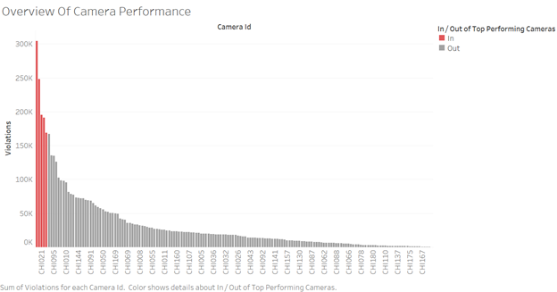

Although the visualization targets to gain the overview of cameras it also helps to identify the sensitive locations associated with those camera positions where there are high violations recorded. Further to learn more about how consistent are the cameras in capturing high violations across time, below visualization was created for the trend of rank violations associated to the top 5 cameras. On observation it can be inferred that the cameras with ids CHI045 and CHI149 have consistently been the cameras to capture highest violations across years.

Source:[@tableau]
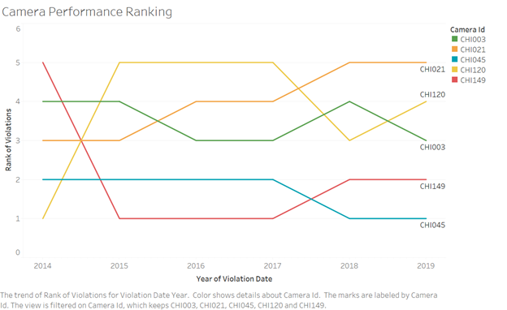

Another visualization is created to pin down the locations of the above cameras on the map.

Source:[@tableau]
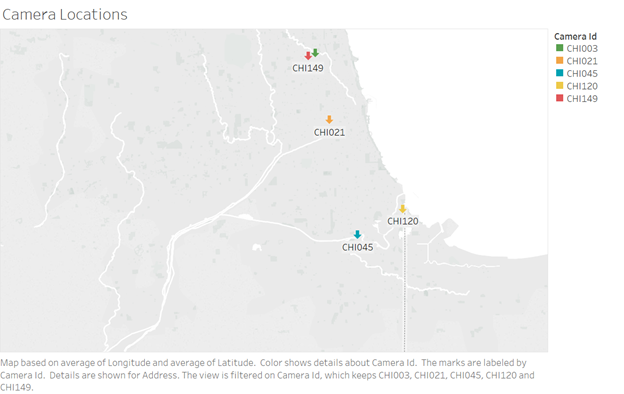

It is essential to analyze the underlying aspects with the consistency of top performing cameras. The speed cameras were installed with purport to protect school children and pedestrians; the overall objective of the program is to utilize various safety measures to enforce the speed limit. Conflicting conclusions exist in theory several studies consider only speed reduction and many overlook the fundamental measure of safety, the violation rate from the finding one even though there is a significant decline in the overall rate of violations. Coming down to specific location or camera level the consistent position of cameras for higher violations captured raises a concern that there exist some flaws in the safety program which fails to impose more safety measures in those particular locations. And, it drives to conclude that the safety program fails to consider public safety as the primary concern. 
Below is an attempt to summarize above visualizations in a dashboard.

Source:[@tableau]
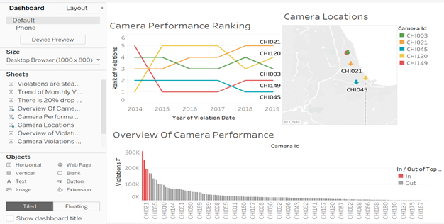

**Result:**

The fact to be conveyed to the Mayor is that there exist high sensitive locations in the city which have consistently recorded more violations across the years. It is crucial for the concerned authorities to investigate the underlying causes and improve safety measure like crossing guards and police officers around schools; and infrastructure improvements, such as signs, crosswalk markings and other traffic safety improvements in the affected locations. With this exercise, a significant number of violations can be reduced.

## Finding 3:
There are a total of 162 cameras installed across the city of Chicago distributed in 40 different zip codes.  12 among those 162 cameras are newly installed in 2018.[@cameradetails] The program claims that Camera locations are chosen based on available data regarding traffic, speeding, and crashes.

Another distribution strategy consistent with public safety would be to have the cameras distributed in areas (zip codes) known to have a higher than average violation rate. If speed camera deployment deviates from these distributions raises concern that public safety was undermined by speed camera program.

**Associated Visualizations:**
The following visualization summed the number of cameras in each zip code and the number of violations from all cameras in each zip code through color concentration. The histogram form of bar chart was chosen to present the distribution of camera counts over zip codes. The inference from this visualization is that distribution of cameras is quite uneven, there are certain zip codes that have high number of cameras installed where the record of violations is lower than the zip codes with fewer cameras. 

Source:[@tableau]
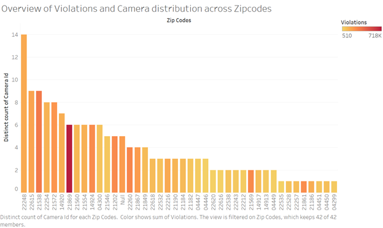

Further, to investigate the implication of violations recorded in bottom ten zip codes to the overall violations the below visualization was created with a tableau filter to group bottom ten zip codes to a set as ‘low violations zip code’ and a bar graph is chosen to present the comparison of  two categories ,the percentage contribution of violations from in and out of the set.  It can be noticed that ~25% of the zip codes in the analysis contribute deficient % of violations, i.e. 3.58%. This provides additional evidence to the claim that some camera installations are ineffective

Source:[@tableau]
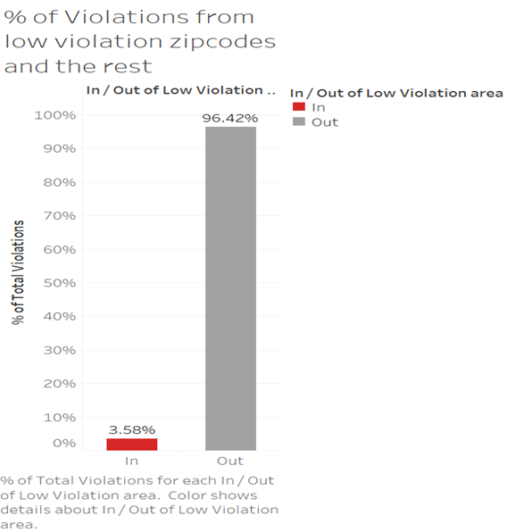

 I then created a visualization to deduce some of the low-efficiency camera locations, more like a table format, using the same set of low violation zip codes, associated addresses, and camera ids. Here the 12 newly installed cameras in 2018 were excluded by the filter as they would naturally have low violations captured.

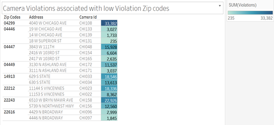
 
The same visualizations was improvised to a bar plot to make it visually more appealing and that it would help to obtain the viewers’ attention to the variation in total violations to respective locations.

Source:[@tableau]
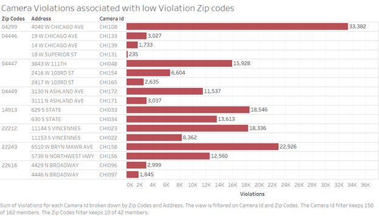

The exciting aspect here is that across the city there are about 1500 safety zones and legally only 20 % of the speed camera installation is allowed. Hence the identification of camera installation locations is a crucial aspect in this speed camera program. With the above visualization analysis, it can be inferred that there exists un even distribution of the cameras. The present low-efficiency camera locations can be safeguarded by other infrastructure improvements, such as signs, crosswalk markings, and other traffic safety improvements. And these cameras can be installed in different safety zones for upholding the goal of public safety.

**Result:**

The Camera distribution across zip codes are uneven in terms of their efficiency. It is required for the Mayor of the city of Chicago to insist on a resurvey to identify critical locations for camera installation.

## Summary:

The lessons learned by data exploration stage, such as to avoid the use of too many colors and complex charts to convey a simple intent were incorporated to the best in this phase. The selection of chart type for the visualizations was made with careful consideration, such as a line chart to represent trends, bar graphs for comparisons and histograms for distribution.
The key aspects extracted from this stage to present the Mayor of the city of Chicago are as follows
1. A decline of violation rate of ~20% from 2015 to 2018 signifies the automated speed enforcement program is impactful to some extent.
2. The consistent high volume of violations captured by cameras across years calls for further safety improvements.
3. The locations for camera installations require a new study by concerned authorities to identify critical safety zones and improve the efficiency of the program.

# Stage 3: 

**Road map for future enhancements:**
This stage of the project will incorporate improvising the visualizations created in the previous phase  and creation of meaningful dashboards by using advanced and interactive features of Tableau.

