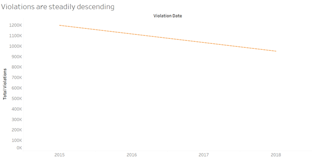

# Stage 3: Revised Version, implementation of improvisations.

The objective of this stage is to improvise the first version of the project based on the roadmap previously defined. Concerning the purpose, a sequence of steps was undertaken to make the visualizations better and improve the context of each visualization.

As a primary step, the first version was reviewed to identify typos and scope of improvements in renaming titles and legends. All the visualizations were revised to exclude typos and further, the charts were analyzed If they are in the context of their argumentation or if there exists a room for improvisation.

In terms of data wrangling in the first version, data were filtered on a worksheet, but as part of improvisation, the data has been filtered globally at the data source level particularly the data of the years 2014 and 2019 has been purposefully excluded from the analysis as they do not contain data for an entire year. Below is the documentation of revisions made with individual findings in an attempt to better present the insight.

## Revision to finding 1 visualizations: 

The intended insight to be conveyed here is that although the overall violations decline across years, across months show fluctuations, and there are few months like November and December and others that show less impact from the speed enforcement program hence require the authorities examine underlying causes.

**Associated revised visualizations:**

Below is one of the visualizations in finding1, ‘Violations are steadily descending’ this chart was improvised in terms of:

*    Editing axis to give a more meaningful name to it.
*    Removal of unnecessary gridlines.
*    The graph line is faded by decreasing the opacity under the color legend leaving behind the trend line.
*    Thus the graph is revised to portray the intended information more straightforwardly.

Source:[@revised]

The next visualization ‘Monthly violations trend’ is the trend across months which has been improvised in terms of:
*     Renaming the y-axis.
*    An advanced feature of the tableau is employed to display the pattern across months in an animated fashion.
*    The name of the control panel is changed.
*    Control panel provides the viewer an opportunity to auto play the change in trend, in a way to make it more visually appealing.

Source:[@revised]

Another visualization part of the finding1 has been improved on the below lines.
*   The first version consisted of a dual axis chart which did not convey any extra information; hence it was excluded in the revised version.
*    The months are categorized by creating a set of impactful months and less impact months.
*    To seek attention towards the months which have shown lower percentage drop the color code has been enhanced to highlight the same. 
*   The title was updated to convey a strong sense of the message.

Source:[@revised]

The corresponding story and dashboards were revised to include all the improvised charts. Below is the dashboard for revised version.

Source:[@revised]

## Revision of finding 2 visualization:

Here the insight being conveyed is that the locations of the cameras CHI045 and CHI149 with their consistent high violations captured raise concerns on the effectiveness of the speed enforcement program.

**Associated revised visualizations:**

Initially, the visualizations were designed to focus on top 5 performing cameras, in the revised version a parameter control is set to provide flexibility to the viewer to select top ‘N’ cameras. The parameter dynamically alters the camera performance set based on the value delivered through the control panel. The parameter control has a minimum of 5 and maximum value of 50 set to limit the range. Also, a geographical visualization is excluded in the revised version as it did not possess significant play in conveying the insight.

The first visualization under the finding 2 is ‘Overview of Camera Performance’ 

Source:[@revised]

The above chart is revised in terms of 
*    Renaming y-axis, filter aliases, and filter titles.
*    A parameter controls to dynamically set-top N cameras of focus is created.

Next visualization displays the ranking positions of top ‘N’ performing cameras. The control of deciding the number of cameras for analysis is provided to the viewer to enable the user to visualize the different ranking pattern as the number of cameras is increased. The title has been edited to make it more appropriate.

Source:[@revised]

The corresponding story and dashboards were revised to include all the improvised charts. Below is the dashboard for revised version. One of the key feature included in this dashboard is that the parameter control is applied to both of the visualization which makes it more meaningful to show the number of cameras under focus as well as the corresponding rankings at the same time.

Dashboard for top 5 cameras:

Source: [@revised]

Dashboard for top 10 cameras:

Source(@revised)

Thus in this dashboard one of the interactive feature of tableau is incorporated to make the claim more evident.

## Revision of finding 3 visualization: 

This finding intends that to convey there is variation in performance of the program across zip codes with the influence of the number of cameras installed and importantly to claim to have more cameras installed restricts the violations to a greater extent. In the first version, the attempt was made to drill down to identify less impactful cameras and present them to be replaced. But the approach seemed to diverge away from the insight analysis. Hence few of the visualizations have been wholly revised to convey the argument in a better way.

**Associated revised visualizations:**

The first visualization here is to represent the existence of variation of violations with the impact of the total cameras across zip codes. The revisions made here are as follows.
*    Titles, color legends, and axis labels were changed appropriately.
*    The grid line is left intact as they make the readability of bar plots easier.
*    One of the data points on zip codes was null which has been excluded in the revised version.

Source:[@revised]

To further strengthen the impact of having more cameras at a location the following two visualizations were created as part of a revision to the previous version. Firstly, the zip codes were categorized into 2 sets under the set name ‘Zipcode Category’ where one set ‘Camera Count>=5’ contains the data of all the zip codes with more than or equal to 5 cameras (4 being the average number of cameras) and the other set ‘Camera Count <5’ contains the rest of the zip codes.
The below visualization serves a basis of the analysis to provide the actual count of cameras that are being compared for their impact being grouped under different categories. Here the aliases and coloring conventions have been maintained in consistent to related visualization.

Source: [@revised]

Next visualization, with the help of previous charts stands to claim the argument that zip codes with higher cameras restrict violations to greater extent. Here the title, color legend aliases and the axis labels are edited appropriately.

Source: [@revised]

The corresponding story and dashboards include the revised charts. Below is the dashboard for the finding 3.

Source: [@revised]

## Summary :

Without hampering the insights recognized in the first version of the project, an attempt has been made to improvise the visualizations in terms of appropriate titles, excluding typos, the addition of meaningful axis and control panel labels. Also, the visualizations from the first version were criticized in terms of their ability to present the argumentation, and necessary additions and deletions were incorporated.  Some of the advanced features of tableau were employed such as autoplay (animation charts), parameter control. Overall the revision is made to powerfully convey the below three insights to the Mayor of Chicago.
1.	The speed enforcement program has a positive impact overall, yet   November, December and a few other months need focus from authorities.
2.	The consistent high volume of violations captured by particular cameras across years calls for further safety improvements in those locations.
3.	More installation of cameras, better control of violations.

